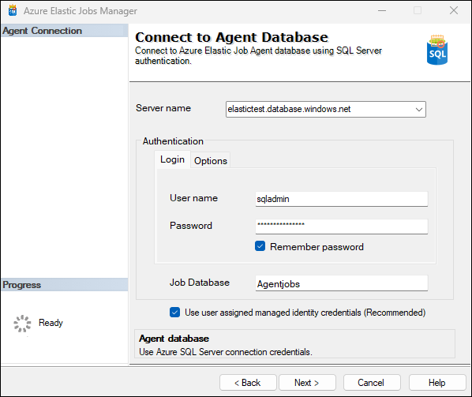

# Connecting to Azure SQL Database with Elastic Jobs Configured

## Overview
The **Login Screen** allows users to connect to an Azure SQL database where elastic jobs are configured. Users need to provide login details with minimum permissions. The authentication method used is SQL Server Authentication.

## Connection Details

1. **Server Name**
   - Enter the server name of your Azure SQL database in the 'Server name' field.

2. **Authentication**
   - Select 'SQL Server Authentication' from the dropdown menu.
   - Enter your username in the 'User name' field.
   - Enter your password in the 'Password' field.
   - Optionally, check the 'Remember password' box if you want the application to remember your login credentials.

3. **Additional Properties**
    - Click on ‘Options’.
    - Under ‘Connection Properties’, ensure that:
        - ‘Encrypt connection’ is checked if you want to encrypt data sent between your application and SQL Database over the network.
        - ‘Trust server certificate’ is checked if you trust your server’s SSL certificate and want to bypass verification.

4. **Connection Timeout**
    - Set an appropriate timeout period (in seconds) during which a connection attempt will be made before it’s terminated.

5. **Job Database**
    – Select a job database from dropdown or leave it as default if not required.

6. Click on ‘Connect’.

{: .note }
Ensure that permissions are set up appropriately, adhering to the principle of least privilege, granting only necessary permissions needed for elastic jobs operations.
